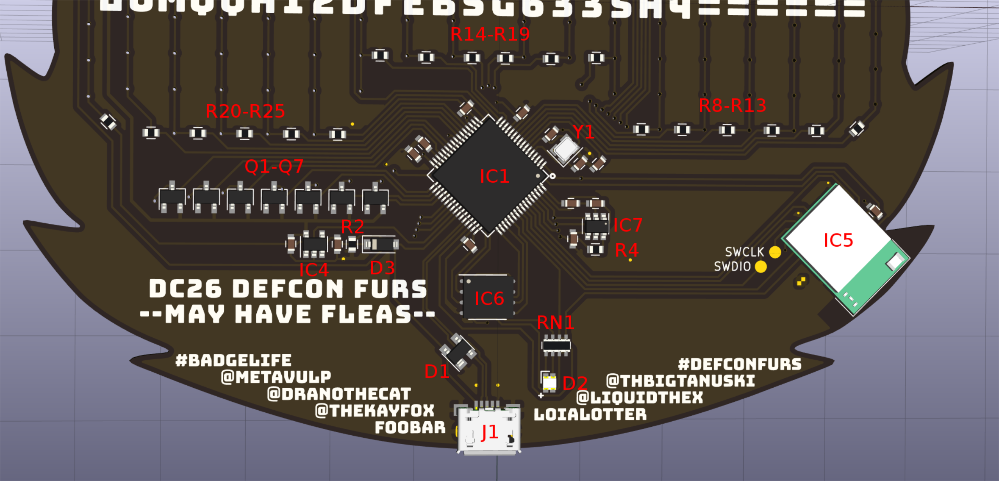
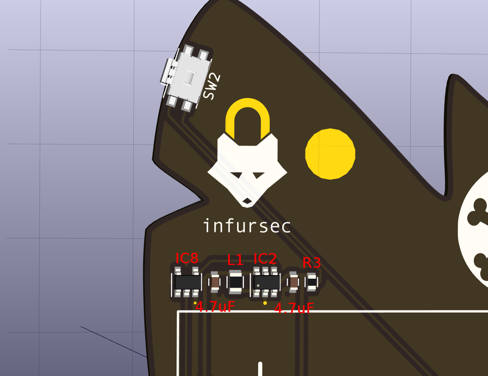
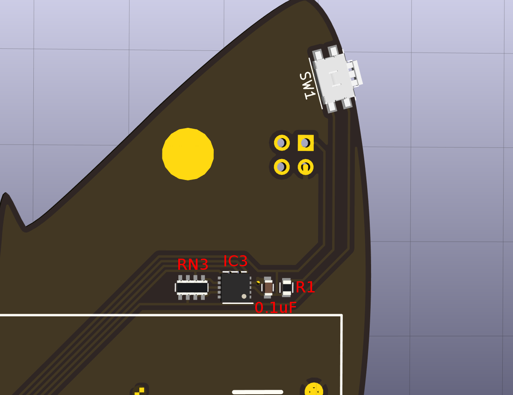
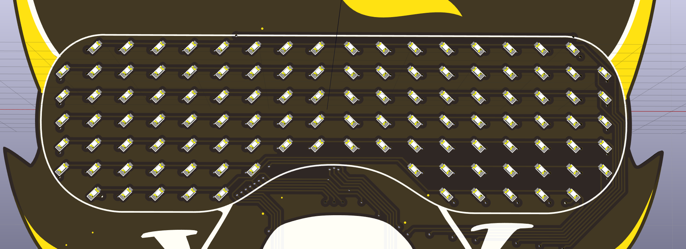

Assembly Guide
==============

Bill of Materials
-----------------

| Designator                | Quantity | Part Number                                                                                   | Description |
|---------------------------|----------|-----------------------------------------------------------------------------------------------|-------------|
| IC1                       | 1        | [STM32F411RET6](https://www.mouser.com/ProductDetail/511-STM32F401RET6)                       | STM32F4 Microcontroller |
| IC2                       | 1        | [AAT1217ICA-3.3-T1](https://www.mouser.com/ProductDetail/873-AAT1217ICA3.3T1)                 | Boost Converter |
| IC3                       | 1        | [MMA7660FCR1](http://www.newark.com/nxp/mma7660fct/3-axis-accelerometer-1-5g-dfn/dp/74P0443?st=MMA7660) | Accelerometer |
| IC4                       | 1        | [MIC5504-3.3](https://www.mouser.com/ProductDetail/998-MIC5504-3.3YM5TR)                      | 3.3V LDO Regulator |
| IC5                       | 1        | [EYSGCNZWY](https://www.mouser.com/ProductDetail/963-EYSGCNZWY)                               | Bluetooth Low Energy Module |
| IC6                       | 1        | [MX25L3206EZNI-12G](https://www.digikey.com/product-detail/en/macronix/MX25L3206EZNI-12G/1092-1077-ND/2744760) | 32Mbit SPI flash |
| IC7                       | 1        | [IQS231A-00004000TSR](https://www.mouser.com/ProductDetail/957-IQS231A004000TSR)              | Capacative Touch Controller |
| IC8                       | 1        | [MC74VHC1G04DTT1G](https://www.mouser.com/ProductDetail/863-MC74VHC1G04DTT1G)                 | 74AHC1G04 Single Inverter |
| C2,C3,C8,C13,C14,C15,C16  | 7        | [C1608X5R1C475MAC](https://www.mouser.com/ProductDetail/810-C1608X5R1C475MAC)                 | 4.7uF MLCC Capacitor |
| C1,C4,C5,C6,C9,C10,C17    | 7        | [C0603C104J4RACTM](https://www.mouser.com/ProductDetail/80-C0603C104J4RACTM)                  | 0.1uF MLCC Capacitor |
| C7,C11,C12                | 3        | [GCM1885C1H120JA16D](https://www.mouser.com/ProductDetail/81-GCM1885C1H120JA6D)               | 12pF MLCC Capacitor |
| RN1                       | 1        | [CAT16-331J4LF](https://www.mouser.com/ProductDetail/652-CAT16-331J4LF)                       | 4x330 Ohm Resistor Array |
| RN3                       | 1        | [CAT16-472J4LF](https://www.mouser.com/ProductDetail/652-CAT16-472J4LF)                       | 4x4.7k Ohm Resistor Array |
| R1,R2,R4                  | 3        | [ERJ-1GNJ471C](https://www.mouser.com/ProductDetail/667-ERJ-1GNJ471C)                         | 470 Ohm 0603 Resistor |
| R8 through R25            | 18       | [ERJ-3GEYJ330V](https://www.mouser.com/ProductDetail/667-ERJ-3GEYJ330V)                       | What did we actually use? |
| D1-0 through D7-18        | 112      | [150060GS75000](https://www.mouser.com/ProductDetail/710-150060GS75000)                       | 525nm Green 0603 LED |
| Q1 through Q7             | 7        | [DMG2305UX-7](https://www.mouser.com/ProductDetail/621-DMG2305UX-7)                           | SOT-23 P-Channel MOSFET |
| D1                        | 1        | [PRTR5V0U2X](https://www.mouser.com/ProductDetail/771-PRTR5V0U2X-T-R)                         | ESD Protection Diode |
| D2                        | 1        | [LTST-C19HE1WT](https://www.mouser.com/ProductDetail/859-LTST-C19HE1WT)                       | RGB Status LED |
| D3                        | 1        | [BAS16GWX](https://www.mouser.com/ProductDetail/841-BAS16GWX)                                 | SOD-123 General Purpose Diode |
| Y1                        | 1        | [ABM10-166-12.000MHz-T3](https://www.mouser.com/ProductDetail/815-ABM10-166-12T)              | 12MHz Crystal Oscillator |
| L1                        | 1        | [LQM21PN2R2MCHD](https://www.mouser.com/ProductDetail/81-LQM21PN2R2MCHD)                      | 2.2uH Inductor |
| J1                        | 1        | [10118193-0001LF](https://www.mouser.com/ProductDetail/649-10118193-0001LF)                   | USB Micro-B Connector |
| SW1,SW2                   | 2        | [434331045822](https://www.digikey.com/product-detail/en/wurth-electronics-inc/434331045822/732-7055-1-ND/5225503) | Tactile Switch |
| BT1                       | 1        | [BC12AAPC](https://www.digikey.com/product-detail/en/mpd-memory-protection-devices/BC12AAPC/BC12AAPC-ND/2439230) | 2xAA Battery Holder |

Part Placements
---------------
The following images demonstrate the locations of the components on the back of the badge.

Once all the parts of the bottom of the badge are soldered in place, you can test the board
by flashing the firmware via USB/DFU and then verifying that you can connect to the python
REPL.

As a word of warning, the EYSGCNZWY Bluetooth module is very difficult to solder by hand,
you will have your best chance of success using solder paste and a reflow oven. However,
the BLE module is not required for the correct operation of the badge.

LED Placements
--------------
All of the LEDs on the front of the badge are oriented with the anode (positive) end of the
LEDs oriented towards the top of the badge, and the cathode (negative) end of the LED
towards the bottom of the badge.

